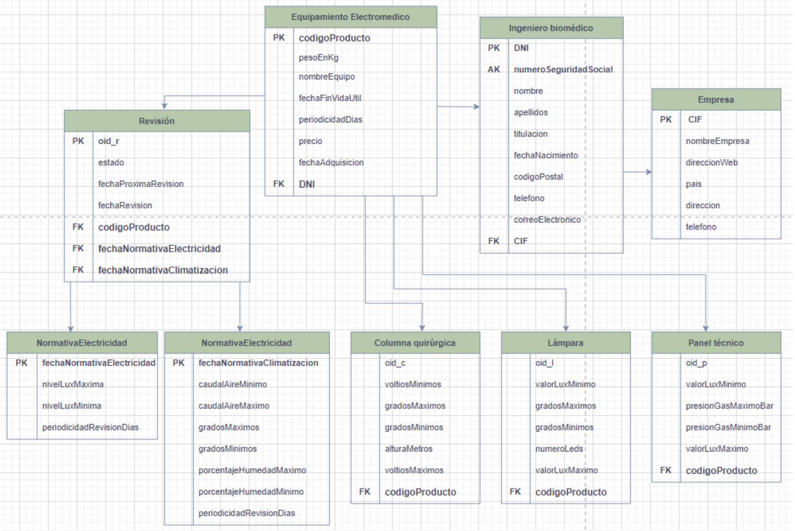

## Description of the problem
The requirements of compliance with certain standards of quality and asepsis in an operating room entail an adequate management and control of all its elements, their knowledge, maintenance and replacement or repair. Different profiles are involved in this function and must be able to access the information in an orderly manner. In order to respond to this situation, we propose the creation of a database to manage all the information related to the equipment, installations and electro-medical equipment in an operating room. The
objective is that the three access profiles (the biomedical engineer, the director of general services of the hospital and the maintenance engineer) can access and know all the elements of our operating room, as well as their attributes, the company from which they have been purchased, know how often they have to be replaced, and know how often they have to be replaced.
The company from which they have been purchased, how often the machinery needs to be serviced or the values between which our equipment must move in order to function correctly (temperature, voltage, etc.), among other things.

## Solution
In the case we are working on, the idea is to create a relational database for a standard operating room, i.e. a general database that can be applied to any type of operating room and, if necessary, can be scalable for a more complex type of operating room.

## General requirements
1. To store the personal data of the biomedical engineer in charge of the maintenance of the machines of the company to which he/she belongs.
2. Store all information on the electro-medical equipment available, as well as information on air-conditioning and electrical regulations.
3. The system shall be able to detect any information failure in the electro-medical equipment as well as in the electricity and air-conditioning of the operating room.
4. The system shall manage the revisions of the operating room installations and control their proper functioning.
5. The system shall be able to consult the information in the database and filter it on the basis of different attributes, such as price, year of purchase and weight of the electro-medical equipment, personal attributes, such as name and surname and social security number.

 

## View project in pdf
[Database of the equipment of an operating room project](Proyecto-base-de-datos-QUIROFANO.pdf)
